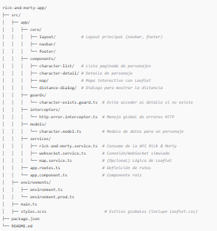

Rick & Morty Angular App
Este proyecto cumple con la prueba técnica de Angular solicitada, incluyendo:

Consumo de API de Rick & Morty con async/await.

Lista paginada de personajes y detalle con un Guard que impide el acceso si no existe el personaje.

Mapa interactivo con Leaflet, mostrando una ruta entre dos puntos de Bogotá y la distancia calculada mediante la función Haversine.

WebSocket (opcional) con modo simulado y real, capaz de mostrar mensajes y enviar confirmaciones.

Desplegado en Vercel para su fácil acceso y revisión.

1. Requerimientos
Node.js (v14+ o v16+ recomendado).

Angular CLI (v15+ o v16+) si deseas ejecutar comandos de Angular.

Conexión a internet para instalar dependencias y probar la API de Rick & Morty.

Características Principales
Paginación: Usa la API de Rick & Morty para mostrar la lista de personajes por página.

Guard: CharacterExistsGuard evita acceder a /character/:id si el personaje no existe.

Mapa: Usa Leaflet para trazar una ruta entre dos puntos (Bogotá), mostrando la distancia calculada con Haversine.

WebSocket: Conexión real o simulada (cada 5s) para mostrar mensajes.

Despliegue: Disponible en Vercel para revisión inmediata.

3. Instalación
Clona el repositorio

git clone https://github.com/MaikolRaw/rick-morty-app.git
cd rick-morty-app
Instala las dependencias

npm install
Asegúrate de tener @angular/cli instalado globalmente o usa npx.

Configura los entornos (opcional)

src/environments/environment.ts para desarrollo.

src/environments/environment.prod.ts para producción.
Ajusta apiUrl, websocketUrl, o simulateWebSocket según tu preferencia.

Ejecuta en modo desarrollo

npm start
Esto iniciará la aplicación en http://localhost:4200.

4. Uso
Lista de personajes: Navega a http://localhost:4200/characters para ver la lista paginada.

Haz clic en un personaje para ver su detalle.

Detalle: http://localhost:4200/character/:id muestra la información del personaje.

Si el personaje no existe, se redirige a /characters.

Mapa: http://localhost:4200/map muestra un mapa centrado en Bogotá, traza una ruta y abre un diálogo con la distancia calculada.

WebSocket:

Si simulateWebSocket está en true, cada 5s simulará un mensaje del backend.

Si está en false, conectará a environment.websocketUrl.

5. Despliegue
El proyecto está desplegado en Vercel. Puedes acceder a la versión en línea a través del siguiente enlace (ejemplo):

arduino

https://rick-morty-app.vercel.app
(Cambia la URL si usas otro dominio)

Otras plataformas (Netlify, etc.)
Build de producción

ng build --prod
Sube la carpeta dist/rick-morty-app a tu plataforma de hosting.

Configura un redirect para rutas de Angular (si es necesario).

6. Notas Técnicas
Consumo de API:

Se utilizan promesas (async/await) y firstValueFrom en el RickAndMortyService para evitar .subscribe() en los componentes.

Manejo de errores:

HttpErrorInterceptor intercepta los errores HTTP y muestra un Snackbar con el mensaje.

Guard:

CharacterExistsGuard llama a getCharacterById() y, si falla, redirige a /characters.

Mapa Leaflet:

Importa leaflet.css en styles.scss.

MapService (opcional) para desacoplar la lógica de Leaflet.

WebSocket:

WebsocketService puede simular mensajes cada 5 segundos o conectarse a un servidor real.

Expone connectionError$ para que los componentes se suscriban a errores.

7. Créditos
API: Rick and Morty API

Mapa: Leaflet + OpenStreetMap

Autor: Maikol Ortiz

Fecha: 03/25/2025

